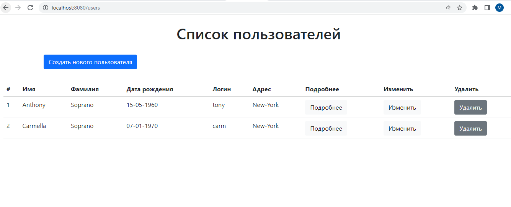
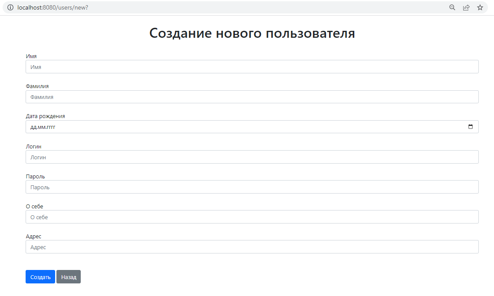
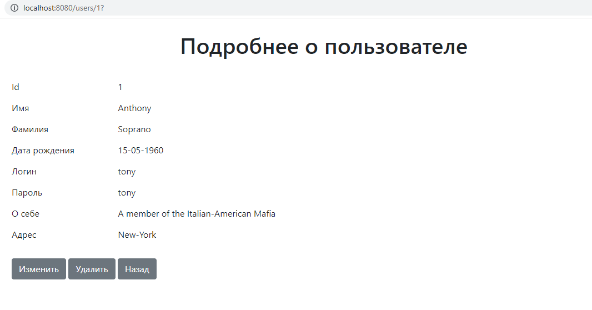
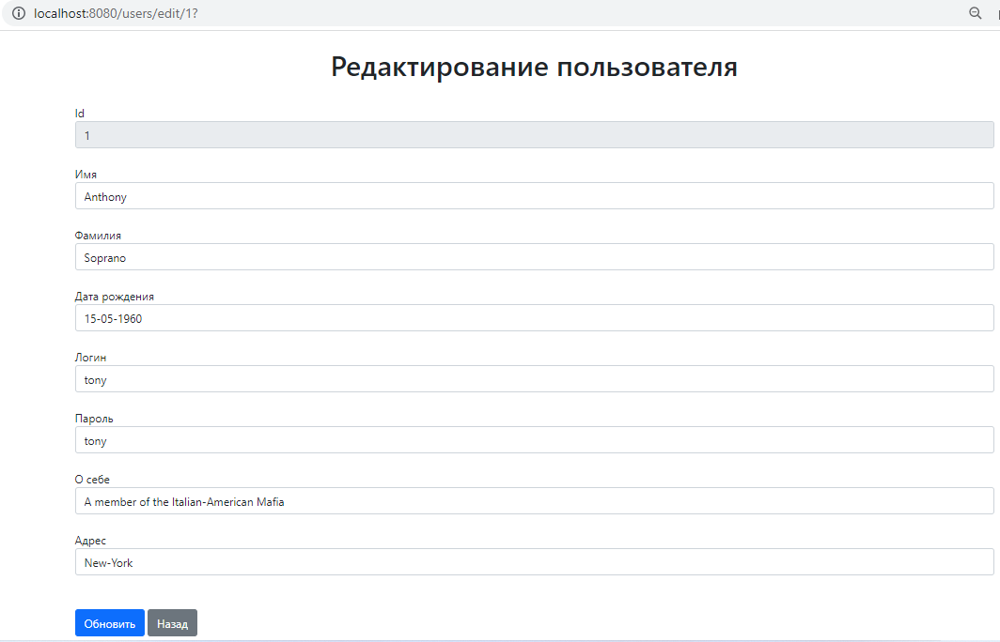

# users-crud-nscdev-test
### *(Users CRUD web app. Spring Boot + Data + MVC + PostgreSQL +Thymeleaf + Bootstrap)*

 
Программа представляет собой web- приложение по работе с пользователями.
Предоставляет REST API для:

* получения списка всех пользователей;

* создания, получения (по id), удаления, редактирования пользователя;

 

 

## Запуск приложения
1. Git [clone](https://github.com/Laboulaye/users-crud-nscdev-test.git).
2. В файле *resources/application.properties* изменить данные подключения к БД datasource *url/username/password* на свои.
3. Запустить в IDE и перейти в браузере на *http://localhost:8080/users*.

## Работа приложения

Приложение обрабатывает REST-запросы (GET-получить, POST-создать, PUT-обновить, DELETE-удалить).

 
 

 

 

 

